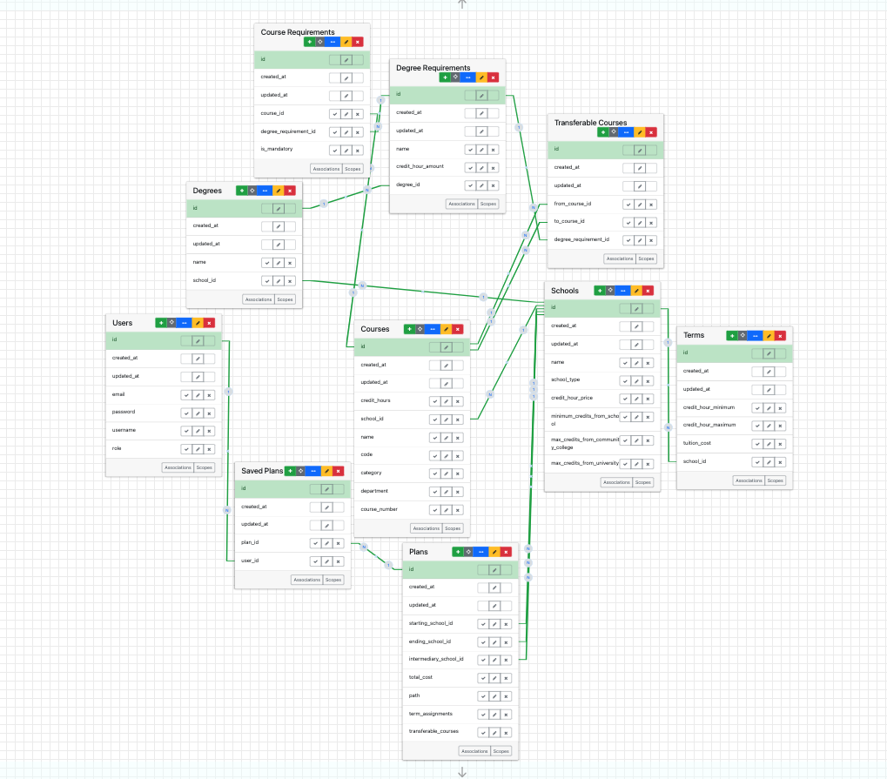
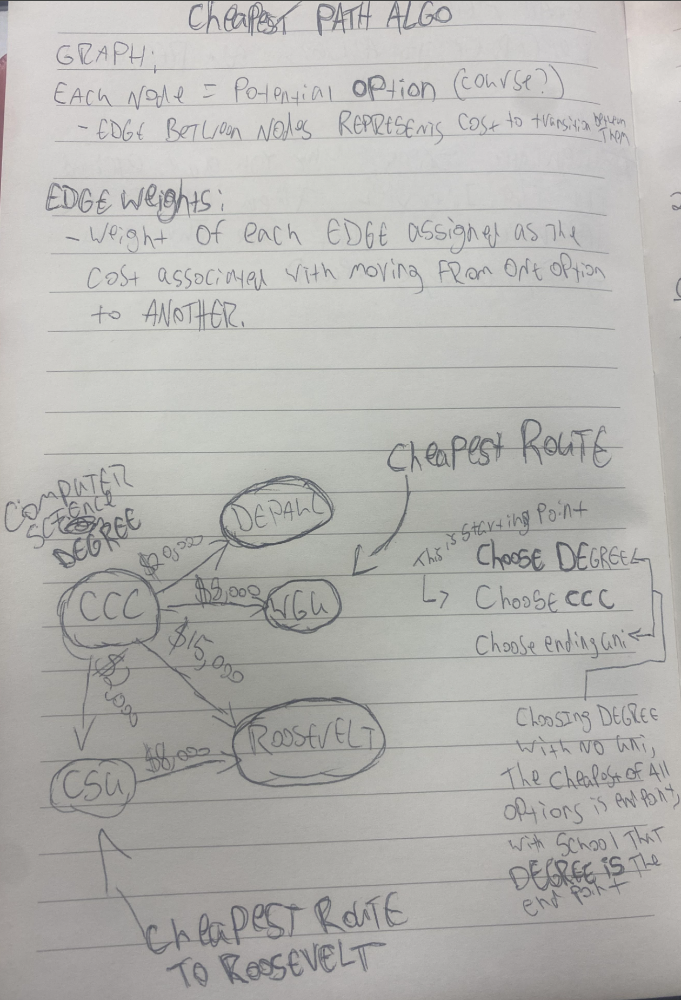

# Discount Degree

## Description
Discount Degree is a web app that shows users the cheapest path to get a degree from an acreddited four year university.
It will show you all available transfer credits from a community college, and possibly a cheaper intermediary university, before finishing the degree at the university of choice. 

## Table of Contents
- [Installation](#installation)
- [Usage](#usage)
- [Contributing](#contributing)
- [License](#license)
- [Contact](#contact)
- [Current State](#current-state-of-project)

## Installation

1. Clone the repository:
`git clone https://github.com/Testell/discount_degree`

2. Navigate to the project directory:
`cd discount_degree`

3. Install the required gems:
`bundle install`

4. Set up the database:
`rails db:setup`

5. Run:
`rails db:migrate`
  - This will give you:
    - A admin account email: admin@example.com pw: admin123
    - Sample data with courses/transferable courses, a degree, 3 schools, and it will generate a plan.

6. Start the Rails server:
`rails server`

## Usage

1. Start the Rails server:
`rails server`

2. Open your browser and navigate to http://localhost:3000

3. Sign into admin account to have access to admin workflows

## Contributing

Contributions are welcome! Please follow these guidelines:

1. Fork the repository
2. Go to [Project Board](https://github.com/users/Testell/projects/2/views/1)
3. Create a new branch from a issue on the project board
4. Commit your changes (`git commit -m 'Add some feature'`)
5. Push to the branch (`git push origin feature-branch`)
6. Open a pull request
7. There is a rubocop check for [Prettier Ruby](https://github.com/prettier/plugin-ruby) to be used on all .rb files
8. Please use [erb-formatter](https://github.com/nebulab/erb-formatter) for all .erb files

## License
Distributed under the MIT License. See `LICENSE` for more information.

## Contact

Tyler - [tylerestell1@gmail.com](mailto:tylerestell1@gmail.com)
Project Link: [https://github.com/Testell/discount_degree](https://github.com/Testell/discount_degree)

## Current state of project

- Next steps for domain modeling:
  1. Plans needs to be refactored to account for custom user plans in the future
  2. All is_mandatory = false course_requirement courses should be saved as a list of options
  3. List of options is all possible courses at school that can be chosen(ex. All philospohy classes for philosphy requirement)
  4. User plans table which is identical to plans will be the users custom plans with all optional courses chosen

- Next steps for Algo
  - It is broken. What started off as an off by 1 error turned into a mess with bad sample data.
  1. The main problem is if an exact amount of credits can not be found for a degree requirement, a significant amount
      of credits will be added PAST the required amount. This is from starting the process over again, and eventually a bug happens where 
      more classes then needed are added. I believe this is happening in the reconstruct_path method of the cheapest_plan_generater service file
  
  Sketch for algo:

  
